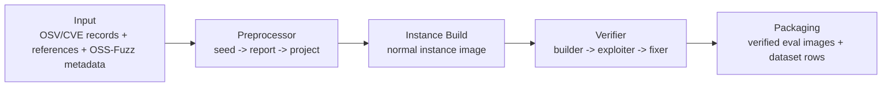
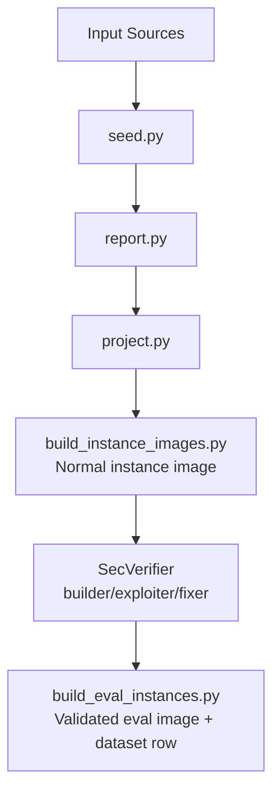
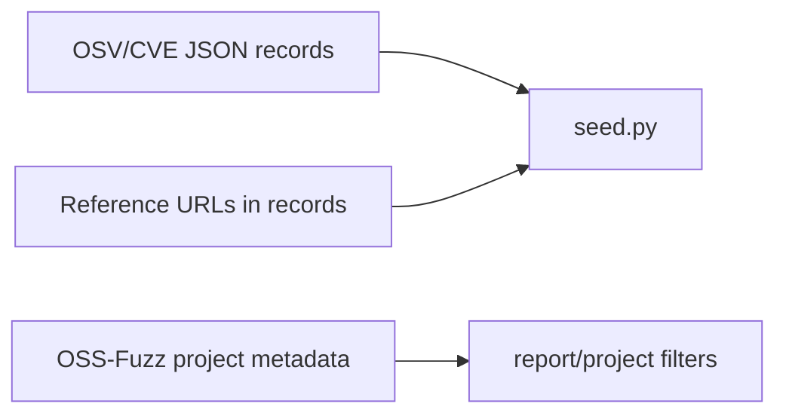
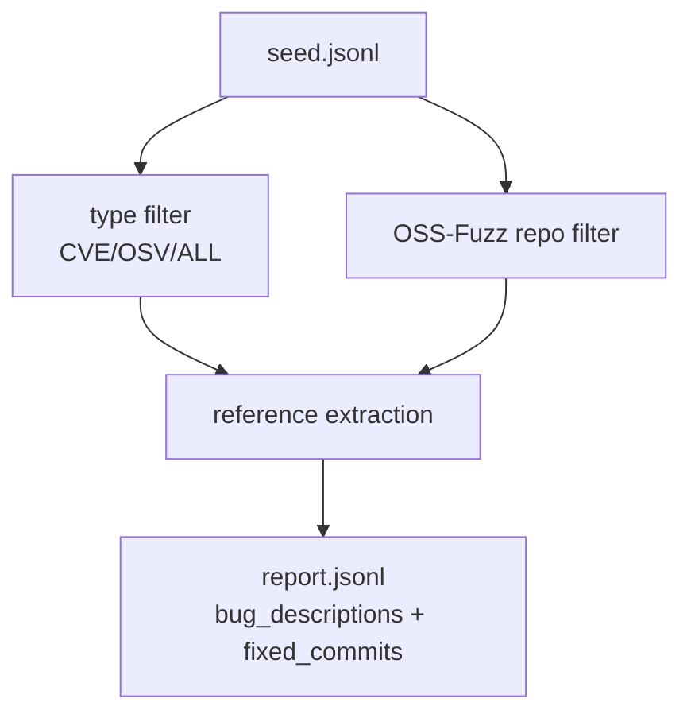
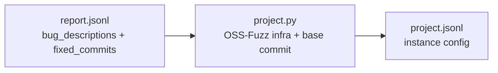
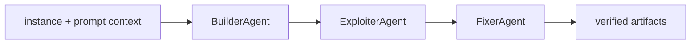
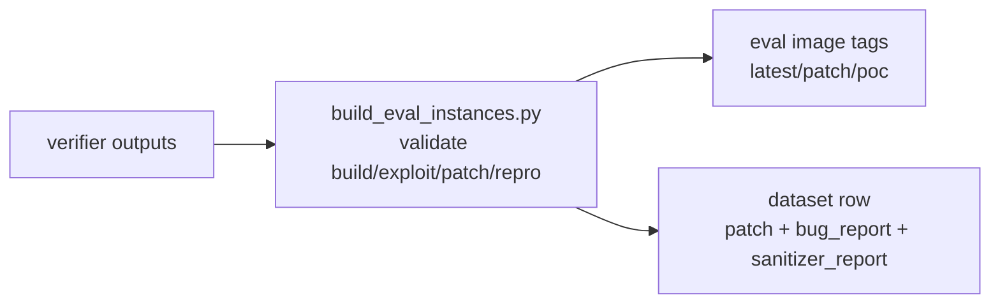

# SEC-bench Construction Phase

This document focuses on **construction** of SEC-bench assets (data, instances, verified outputs). It is **not** a scoring-method deep dive.

## 1. Construction Phase: Summary
SEC-bench construction can be understood as:



Key outputs by stage:
1. `seed` output: vulnerability metadata JSONL.
2. `report` output: metadata + extracted `bug_descriptions` and `fixed_commits`.
3. `project` output: reproducible instance configs (`bug_description`, `work_dir`, `sanitizer`, `candidate_fixes`, etc.).
4. normal instance image: `hwiwonlee/secb.x86_64.{instance_id}:latest`.
5. verified eval image: `hwiwonlee/secb.eval.x86_64.{instance_id}` plus tags (`latest`, `patch`, `poc`).
6. final dataset rows (including `patch`, `bug_report`, `sanitizer_report`, `exit_code`) from verified packaging.

Evidence:
[run_preprocessor.sh:8](/Users/garfield/PycharmProjects/SEC-bench/run_preprocessor.sh:8), [run_preprocessor.sh:9](/Users/garfield/PycharmProjects/SEC-bench/run_preprocessor.sh:9), [run_preprocessor.sh:10](/Users/garfield/PycharmProjects/SEC-bench/run_preprocessor.sh:10), [build_instance_images.py:27](/Users/garfield/PycharmProjects/SEC-bench/secb/preprocessor/build_instance_images.py:27), [build_instance_images.py:29](/Users/garfield/PycharmProjects/SEC-bench/secb/preprocessor/build_instance_images.py:29), [build_eval_instances.py:28](/Users/garfield/PycharmProjects/SEC-bench/secb/evaluator/build_eval_instances.py:28), [build_eval_instances.py:29](/Users/garfield/PycharmProjects/SEC-bench/secb/evaluator/build_eval_instances.py:29), [build_eval_instances.py:1123](/Users/garfield/PycharmProjects/SEC-bench/secb/evaluator/build_eval_instances.py:1123), [build_eval_instances.py:1133](/Users/garfield/PycharmProjects/SEC-bench/secb/evaluator/build_eval_instances.py:1133).

## 2. Repository Responsibility
| Repository | Construction responsibility | Evidence |
|---|---|---|
| `SEC-bench` | Canonical preprocess/build/package pipeline and eval-image generation | [README.md:26](/Users/garfield/PycharmProjects/SEC-bench/README.md:26), [README.md:93](/Users/garfield/PycharmProjects/SEC-bench/README.md:93), [README.md:168](/Users/garfield/PycharmProjects/SEC-bench/README.md:168), [README.md:211](/Users/garfield/PycharmProjects/SEC-bench/README.md:211) |
| `SecVerifier` | Builder/Exploiter/Fixer agent workflow used to produce and verify artifacts for packaging | [single-agent.py:917](/Users/garfield/PycharmProjects/SecVerifier/single-agent.py:917), [single-agent.py:960](/Users/garfield/PycharmProjects/SecVerifier/single-agent.py:960), [single-agent.py:1022](/Users/garfield/PycharmProjects/SecVerifier/single-agent.py:1022) |

## 3. E2E Architecture


Pipeline order is explicitly wired as separate `seed`, `report`, `project` modes in the wrapper script:
[run_preprocessor.sh:260](/Users/garfield/PycharmProjects/SEC-bench/run_preprocessor.sh:260), [run_preprocessor.sh:263](/Users/garfield/PycharmProjects/SEC-bench/run_preprocessor.sh:263), [run_preprocessor.sh:274](/Users/garfield/PycharmProjects/SEC-bench/run_preprocessor.sh:274).

## 4. Each Step Flow

### Step 0. Input Data Collection
| Item | Details |
|---|---|
| Input data | OSV/CVE records + reference URLs + repository metadata + OSS-Fuzz project metadata |
| What this does | Provides raw vulnerability records and reference links for later extraction/filtering |
| Output data | raw records consumed by `seed.py` |



Evidence:
[seed.py:4](/Users/garfield/PycharmProjects/SEC-bench/secb/preprocessor/seed.py:4), [run_preprocessor.sh:8](/Users/garfield/PycharmProjects/SEC-bench/run_preprocessor.sh:8), [run_preprocessor.sh:30](/Users/garfield/PycharmProjects/SEC-bench/run_preprocessor.sh:30).

### Step 1. `seed` Phase
| Item | Details |
|---|---|
| Input data | Raw vulnerability JSON files (`--input-dir`) |
| What this does | Parses core vulnerability metadata and repo info |
| Output data | seed JSONL fields such as `id`, `references`, `fixed`, `repo_url`, `language` |


Evidence:
[seed.py:26](/Users/garfield/PycharmProjects/SEC-bench/secb/preprocessor/seed.py:26), [seed.py:29](/Users/garfield/PycharmProjects/SEC-bench/secb/preprocessor/seed.py:29), [seed.py:31](/Users/garfield/PycharmProjects/SEC-bench/secb/preprocessor/seed.py:31), [seed.py:33](/Users/garfield/PycharmProjects/SEC-bench/secb/preprocessor/seed.py:33), [seed.py:35](/Users/garfield/PycharmProjects/SEC-bench/secb/preprocessor/seed.py:35), [run_preprocessor.sh:261](/Users/garfield/PycharmProjects/SEC-bench/run_preprocessor.sh:261).

### Step 2. `report` Phase (CVE vs OSS-Fuzz consolidated here)
| Item | Details |
|---|---|
| Input data | seed JSONL |
| What this does | Filters by vuln type/language/repo/OSS-Fuzz and extracts report text + fix commits from references |
| Output data | report JSONL with `bug_descriptions` (list of `{source,url,text}`) and `fixed_commits` |



How CVE vs OSS-Fuzz differs in this step:
1. CVE/OSV is vulnerability-type filtering (`--type` + ID checks).
2. OSS-Fuzz is project-membership filtering (`--oss-fuzz` against known OSS-Fuzz project repos).

Evidence:
[run_preprocessor.sh:26](/Users/garfield/PycharmProjects/SEC-bench/run_preprocessor.sh:26), [run_preprocessor.sh:30](/Users/garfield/PycharmProjects/SEC-bench/run_preprocessor.sh:30), [run_preprocessor.sh:272](/Users/garfield/PycharmProjects/SEC-bench/run_preprocessor.sh:272), [report.py:2356](/Users/garfield/PycharmProjects/SEC-bench/secb/preprocessor/report.py:2356), [report.py:2360](/Users/garfield/PycharmProjects/SEC-bench/secb/preprocessor/report.py:2360), [report.py:2750](/Users/garfield/PycharmProjects/SEC-bench/secb/preprocessor/report.py:2750), [report.py:2952](/Users/garfield/PycharmProjects/SEC-bench/secb/preprocessor/report.py:2952), [report.py:2561](/Users/garfield/PycharmProjects/SEC-bench/secb/preprocessor/report.py:2561), [report.py:2595](/Users/garfield/PycharmProjects/SEC-bench/secb/preprocessor/report.py:2595), [report.py:2622](/Users/garfield/PycharmProjects/SEC-bench/secb/preprocessor/report.py:2622).

### Step 3. `project` Phase
| Item | Details |
|---|---|
| Input data | report JSONL |
| What this does | Resolves vulnerable base commit, fetches OSS-Fuzz project files, constructs reproducible build config, merges report list into one `bug_description`, maps `fixed_commits` to `candidate_fixes` |
| Output data | project JSONL (`instance_id`, `dockerfile`, `build_sh`, `work_dir`, `sanitizer`, `bug_description`, `candidate_fixes`) |



CVE vs OSS-Fuzz in this step:
1. The entry must match an OSS-Fuzz-supported project for this construction path.
2. OSS-Fuzz project files are fetched near vulnerable commit time.

Evidence:
[project.py:1425](/Users/garfield/PycharmProjects/SEC-bench/secb/preprocessor/project.py:1425), [project.py:1474](/Users/garfield/PycharmProjects/SEC-bench/secb/preprocessor/project.py:1474), [project.py:1540](/Users/garfield/PycharmProjects/SEC-bench/secb/preprocessor/project.py:1540), [project.py:1568](/Users/garfield/PycharmProjects/SEC-bench/secb/preprocessor/project.py:1568), [project.py:1573](/Users/garfield/PycharmProjects/SEC-bench/secb/preprocessor/project.py:1573), [project.py:1598](/Users/garfield/PycharmProjects/SEC-bench/secb/preprocessor/project.py:1598), [project.py:1609](/Users/garfield/PycharmProjects/SEC-bench/secb/preprocessor/project.py:1609), [project.py:1611](/Users/garfield/PycharmProjects/SEC-bench/secb/preprocessor/project.py:1611), [run_preprocessor.sh:283](/Users/garfield/PycharmProjects/SEC-bench/run_preprocessor.sh:283).

### Step 4. Normal Instance Image Build
| Item | Details |
|---|---|
| Input data | project JSONL |
| What this does | Builds vulnerable instance image for each instance config |
| Output data | normal image `hwiwonlee/secb.x86_64.{instance_id}:latest` |

```mermaid
flowchart LR
  A[project.jsonl] --> B[build_instance_images.py]
  B --> C[hwiwonlee/secb.x86_64.{instance_id}:latest]
```

Evidence:
[build_instance_images.py:21](/Users/garfield/PycharmProjects/SEC-bench/secb/preprocessor/build_instance_images.py:21), [build_instance_images.py:27](/Users/garfield/PycharmProjects/SEC-bench/secb/preprocessor/build_instance_images.py:27), [build_instance_images.py:29](/Users/garfield/PycharmProjects/SEC-bench/secb/preprocessor/build_instance_images.py:29), [build_instance_images.py:105](/Users/garfield/PycharmProjects/SEC-bench/secb/preprocessor/build_instance_images.py:105).

### Step 5. Verifier (Builder, Exploiter, Fixer)
| Item | Details |
|---|---|
| Input data | Instance workspace + `bug_description` + `candidate_fixes` |
| What this does | Builder validates/fixes build, exploiter reproduces sanitizer-triggering behavior, fixer creates patch and validates no sanitizer error remains |
| Output data | Verified run artifacts (`base_commit_hash`, `repo_changes.diff`, PoC artifacts, `model_patch.diff`, etc.) |



Evidence:
[single-agent.py:303](/Users/garfield/PycharmProjects/SecVerifier/single-agent.py:303), [single-agent.py:307](/Users/garfield/PycharmProjects/SecVerifier/single-agent.py:307), [single_agent_instruction.j2:19](/Users/garfield/PycharmProjects/SecVerifier/prompts/single_agent_instruction.j2:19), [single_agent_instruction.j2:24](/Users/garfield/PycharmProjects/SecVerifier/prompts/single_agent_instruction.j2:24), [single-agent.py:917](/Users/garfield/PycharmProjects/SecVerifier/single-agent.py:917), [single-agent.py:935](/Users/garfield/PycharmProjects/SecVerifier/single-agent.py:935), [single-agent.py:1022](/Users/garfield/PycharmProjects/SecVerifier/single-agent.py:1022), [single-agent.py:1086](/Users/garfield/PycharmProjects/SecVerifier/single-agent.py:1086), [multi-agent.py:435](/Users/garfield/PycharmProjects/SecVerifier/multi-agent.py:435), [multi-agent.py:459](/Users/garfield/PycharmProjects/SecVerifier/multi-agent.py:459), [multi-agent.py:476](/Users/garfield/PycharmProjects/SecVerifier/multi-agent.py:476), [multi-agent.py:477](/Users/garfield/PycharmProjects/SecVerifier/multi-agent.py:477).

### Step 6. Packaging to Eval Images + Final Dataset Rows
| Item | Details |
|---|---|
| Input data | Successful verifier outputs + base instance data |
| What this does | Builds eval image, validates behavior, creates tags, and writes final dataset rows |
| Output data | `hwiwonlee/secb.eval.x86_64.{instance_id}` images + tags and dataset rows with `patch`, `exit_code`, `sanitizer_report`, `bug_report` |



Evidence:
[build_eval_instances.py:850](/Users/garfield/PycharmProjects/SEC-bench/secb/evaluator/build_eval_instances.py:850), [build_eval_instances.py:1087](/Users/garfield/PycharmProjects/SEC-bench/secb/evaluator/build_eval_instances.py:1087), [build_eval_instances.py:1097](/Users/garfield/PycharmProjects/SEC-bench/secb/evaluator/build_eval_instances.py:1097), [build_eval_instances.py:1104](/Users/garfield/PycharmProjects/SEC-bench/secb/evaluator/build_eval_instances.py:1104), [build_eval_instances.py:1111](/Users/garfield/PycharmProjects/SEC-bench/secb/evaluator/build_eval_instances.py:1111), [build_eval_instances.py:1118](/Users/garfield/PycharmProjects/SEC-bench/secb/evaluator/build_eval_instances.py:1118), [build_eval_instances.py:1125](/Users/garfield/PycharmProjects/SEC-bench/secb/evaluator/build_eval_instances.py:1125), [build_eval_instances.py:1133](/Users/garfield/PycharmProjects/SEC-bench/secb/evaluator/build_eval_instances.py:1133), [build_eval_instances.py:796](/Users/garfield/PycharmProjects/SEC-bench/secb/evaluator/build_eval_instances.py:796), [build_eval_instances.py:815](/Users/garfield/PycharmProjects/SEC-bench/secb/evaluator/build_eval_instances.py:815), [build_eval_instances.py:819](/Users/garfield/PycharmProjects/SEC-bench/secb/evaluator/build_eval_instances.py:819).

## 5. Hugging Face Dataset Comparison (`SEC-bench/SEC-bench` vs `SEC-bench/Seed`)

| Item | `SEC-bench/Seed` | `SEC-bench/SEC-bench` |
|---|---|---|
| Constructed from | Preprocessor `project.py` style output | Verified packaging (`build_eval_instances.py`) output rows |
| Typical purpose | Construction input for builder/exploiter/fixer style generation | Final benchmark/eval dataset with validated patch/repro metadata |
| Gold patch column | No `patch` column in this schema | `patch` column exists and is treated as reference/gold patch in prompts/eval contexts |
| `bug_description` | Long merged report text | Published dataset has concise `bug_description` + long `bug_report` |
| `bug_report` | Not present in Seed schema | Present; generated as cleaned report text in packaging pipeline |

Where these are wired in code:
1. SEC-bench evaluation config defaults to `SEC-bench/SEC-bench`.
2. SecVerifier defaults to `SEC-bench/Seed` for construction runs.

Evidence:
[config.example.toml:37](/Users/garfield/PycharmProjects/SEC-bench/config.example.toml:37), [eval_instances.py:1360](/Users/garfield/PycharmProjects/SEC-bench/secb/evaluator/eval_instances.py:1360), [single-agent.py:199](/Users/garfield/PycharmProjects/SecVerifier/single-agent.py:199), [single-agent.py:202](/Users/garfield/PycharmProjects/SecVerifier/single-agent.py:202), [single-agent.py:1185](/Users/garfield/PycharmProjects/SecVerifier/single-agent.py:1185), [multi-agent.py:609](/Users/garfield/PycharmProjects/SecVerifier/multi-agent.py:609), [multi-agent.py:612](/Users/garfield/PycharmProjects/SecVerifier/multi-agent.py:612), [multi-agent.py:1837](/Users/garfield/PycharmProjects/SecVerifier/multi-agent.py:1837).

### Where “gold patch” comes from
`patch` is written in packaging step from extracted `/testcase/model_patch.diff` when available, otherwise fallback patch payload.

Evidence:
[build_eval_instances.py:509](/Users/garfield/PycharmProjects/SEC-bench/secb/evaluator/build_eval_instances.py:509), [build_eval_instances.py:796](/Users/garfield/PycharmProjects/SEC-bench/secb/evaluator/build_eval_instances.py:796), [build_eval_instances.py:804](/Users/garfield/PycharmProjects/SEC-bench/secb/evaluator/build_eval_instances.py:804).

### `bug_descriptions` / `bug_description` / `bug_report` lineage
```mermaid
flowchart LR
  A[report.py\nbug_descriptions list[source,url,text]]
  B[project.py\nbug_description merged full text]
  C[build_eval_instances.py\ncopy bug_description + derive bug_report]

  A --> B --> C
```

Evidence:
[report.py:2561](/Users/garfield/PycharmProjects/SEC-bench/secb/preprocessor/report.py:2561), [report.py:2595](/Users/garfield/PycharmProjects/SEC-bench/secb/preprocessor/report.py:2595), [project.py:1540](/Users/garfield/PycharmProjects/SEC-bench/secb/preprocessor/project.py:1540), [project.py:1568](/Users/garfield/PycharmProjects/SEC-bench/secb/preprocessor/project.py:1568), [project.py:1609](/Users/garfield/PycharmProjects/SEC-bench/secb/preprocessor/project.py:1609), [build_eval_instances.py:781](/Users/garfield/PycharmProjects/SEC-bench/secb/evaluator/build_eval_instances.py:781), [build_eval_instances.py:819](/Users/garfield/PycharmProjects/SEC-bench/secb/evaluator/build_eval_instances.py:819), [build_eval_instances.py:820](/Users/garfield/PycharmProjects/SEC-bench/secb/evaluator/build_eval_instances.py:820), [utils.py:136](/Users/garfield/PycharmProjects/SEC-bench/secb/evaluator/utils.py:136).

### Do we actually use full-data report in SecVerifier?
Short answer: **SecVerifier uses `bug_description`, not `bug_report`**.

1. Prompt rendering in SecVerifier passes `instance['bug_description']` to builder/exploiter/fixer instructions.
2. There is no corresponding prompt usage of `bug_report` in these agent paths.
3. Since SecVerifier default dataset is `SEC-bench/Seed`, and Seed’s `bug_description` is full-report style, SecVerifier typically sees full report text by default.

Evidence:
[single-agent.py:303](/Users/garfield/PycharmProjects/SecVerifier/single-agent.py:303), [single-agent.py:325](/Users/garfield/PycharmProjects/SecVerifier/single-agent.py:325), [multi-agent.py:435](/Users/garfield/PycharmProjects/SecVerifier/multi-agent.py:435), [multi-agent.py:459](/Users/garfield/PycharmProjects/SecVerifier/multi-agent.py:459), [multi-agent.py:476](/Users/garfield/PycharmProjects/SecVerifier/multi-agent.py:476), [single-agent.py:202](/Users/garfield/PycharmProjects/SecVerifier/single-agent.py:202), [multi-agent.py:612](/Users/garfield/PycharmProjects/SecVerifier/multi-agent.py:612).

## 6. DockerHub Image Comparison

### 6.1 Normal instance image vs eval image
| Item | Normal instance image | Eval image |
|---|---|---|
| Naming | `hwiwonlee/secb.x86_64.{instance_id}:latest` | `hwiwonlee/secb.eval.x86_64.{instance_id}` (+ tags) |
| Built by | `build_instance_images.py` | `build_eval_instances.py` |
| Main role | Vulnerable reproducible environment | Verified evaluation-ready environment + benchmark packaging |

Evidence:
[build_instance_images.py:29](/Users/garfield/PycharmProjects/SEC-bench/secb/preprocessor/build_instance_images.py:29), [build_instance_images.py:105](/Users/garfield/PycharmProjects/SEC-bench/secb/preprocessor/build_instance_images.py:105), [build_eval_instances.py:28](/Users/garfield/PycharmProjects/SEC-bench/secb/evaluator/build_eval_instances.py:28), [build_eval_instances.py:29](/Users/garfield/PycharmProjects/SEC-bench/secb/evaluator/build_eval_instances.py:29), [build_eval_instances.py:850](/Users/garfield/PycharmProjects/SEC-bench/secb/evaluator/build_eval_instances.py:850), [CLAUDE.md:60](/Users/garfield/PycharmProjects/SEC-bench/CLAUDE.md:60), [CLAUDE.md:61](/Users/garfield/PycharmProjects/SEC-bench/CLAUDE.md:61), [CLAUDE.md:62](/Users/garfield/PycharmProjects/SEC-bench/CLAUDE.md:62).

### 6.2 `:latest`, `:patch`, `:poc` tag differences (eval images)
| Tag | Cleanup behavior | Why |
|---|---|---|
| `latest` | Keep all files | Full reference state |
| `patch` | Remove `model_patch.diff` | Prevent patch leakage in patch-generation tasks |
| `poc` | Remove patch and PoC files under `/testcase` except base/repo-change control files | Prevent artifact leakage in PoC tasks |

Evidence:
[build_eval_instances.py:458](/Users/garfield/PycharmProjects/SEC-bench/secb/evaluator/build_eval_instances.py:458), [build_eval_instances.py:459](/Users/garfield/PycharmProjects/SEC-bench/secb/evaluator/build_eval_instances.py:459), [build_eval_instances.py:460](/Users/garfield/PycharmProjects/SEC-bench/secb/evaluator/build_eval_instances.py:460), [build_eval_instances.py:461](/Users/garfield/PycharmProjects/SEC-bench/secb/evaluator/build_eval_instances.py:461), [build_eval_instances.py:542](/Users/garfield/PycharmProjects/SEC-bench/secb/evaluator/build_eval_instances.py:542), [build_eval_instances.py:553](/Users/garfield/PycharmProjects/SEC-bench/secb/evaluator/build_eval_instances.py:553), [build_eval_instances.py:558](/Users/garfield/PycharmProjects/SEC-bench/secb/evaluator/build_eval_instances.py:558), [build_eval_instances.py:1104](/Users/garfield/PycharmProjects/SEC-bench/secb/evaluator/build_eval_instances.py:1104), [build_eval_instances.py:1111](/Users/garfield/PycharmProjects/SEC-bench/secb/evaluator/build_eval_instances.py:1111), [build_eval_instances.py:1118](/Users/garfield/PycharmProjects/SEC-bench/secb/evaluator/build_eval_instances.py:1118).

### 6.3 Where these tags are consumed
Even though this doc is construction-focused, tags are consumed by evaluator as:
1. Patch task -> `:patch`
2. PoC task -> `:poc`

Evidence:
[eval_instances.py:719](/Users/garfield/PycharmProjects/SEC-bench/secb/evaluator/eval_instances.py:719), [eval_instances.py:722](/Users/garfield/PycharmProjects/SEC-bench/secb/evaluator/eval_instances.py:722).

---
Paper reference:
- SEC-bench: https://arxiv.org/pdf/2506.11791
