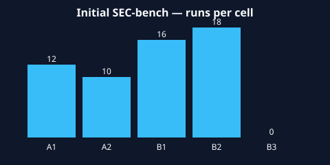

## Overview

Next SEC-bench matrix after removing no-CVE-context treatments. Every cell receives the CVE context and shared SEC-bench task framing; treatments compare Claude Code subagent topology, our Claude-Code-backed hierarchy with verifier off/on, and our Qwen/OpenHands hierarchy with verifier off/on under shared artifact and event metrics scripts.

## Cells

- **A1** (A — Claude Code CLI) — config `configs/A1-claude-code-subagent.yaml`
- **A2** (A — Claude Code CLI) — config `configs/A2-claude-code-nosubagent.yaml`
- **B1** (B — Our System) — config `configs/B1-ours-claude-noverifier.yaml`
- **B2** (B — Our System) — config `configs/B2-ours-claude-verifier.yaml`
- **C1** (C — Our System + Qwen) — config `configs/C1-qwen-noverifier.yaml`
- **C2** (C — Our System + Qwen) — config `configs/C2-qwen-verifier.yaml`

## Runs Summary

Total runs in the scripted summary: **0**.

| Cell | Runs | Deliverables | Tool calls | Tool results | Thinking events | Thinking chars | Tokens | Cost USD | Duration s |
|------|-----:|-------------:|-----------:|-------------:|----------------:|---------------:|-------:|---------:|-----------:|
| A1 | 0 | 0 | 0 | 0 | 0 | 0 | 0 | 0.000000 | 0.000 |
| A2 | 0 | 0 | 0 | 0 | 0 | 0 | 0 | 0.000000 | 0.000 |
| B1 | 0 | 0 | 0 | 0 | 0 | 0 | 0 | 0.000000 | 0.000 |
| B2 | 0 | 0 | 0 | 0 | 0 | 0 | 0 | 0.000000 | 0.000 |
| C1 | 0 | 0 | 0 | 0 | 0 | 0 | 0 | 0.000000 | 0.000 |
| C2 | 0 | 0 | 0 | 0 | 0 | 0 | 0 | 0.000000 | 0.000 |

Raw table: [`reports/tables/summary.csv`](tables/summary.csv)
Per-run metrics: [`reports/tables/run_metrics.csv`](tables/run_metrics.csv)
Totals: [`reports/tables/totals.csv`](tables/totals.csv)

## Artifact Archive

Run traces and testcase deliverables copied by `scripts/collect.py` live under
[`artifacts/`](../artifacts/), grouped by cell, task, replicate, and run id.

## Qualitative Notes

Use the archived `events.jsonl`, `stdout_stderr.log`, `run_manifest.json`, and
testcase files for qualitative review. The numeric table above is generated
from the same event traces.

## Reproducibility

Every file in this `reports/` tree carries provenance metadata (YAML
frontmatter for `.md`, `.generated.json` sidecar for binaries). Re-run
`python -m experiments.shared.scripts.validate_reports` at any time to
verify each output matches the recorded inputs.
