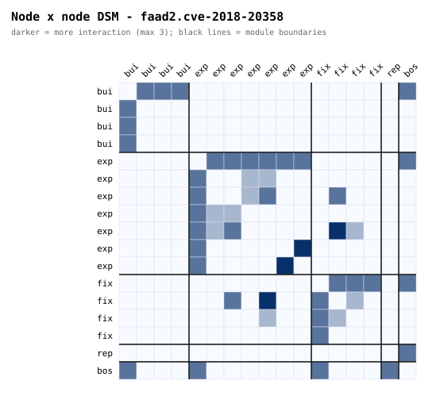
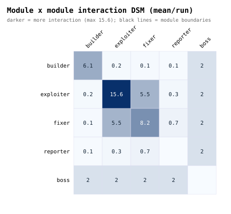
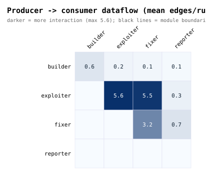
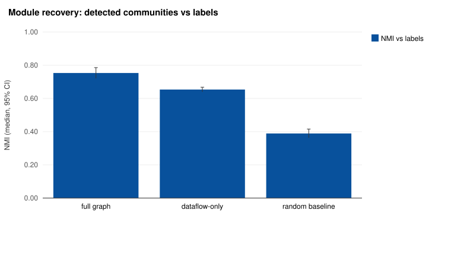
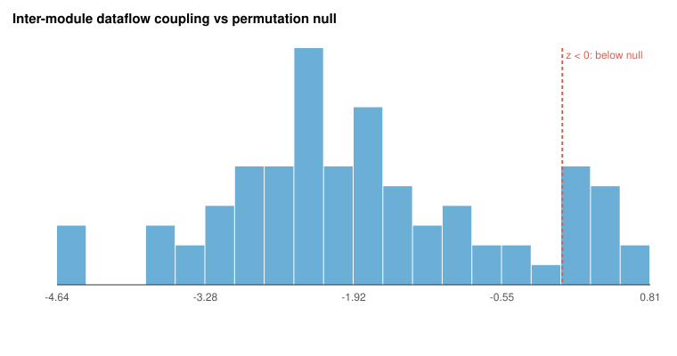
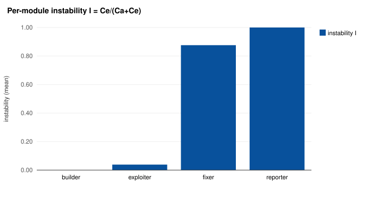
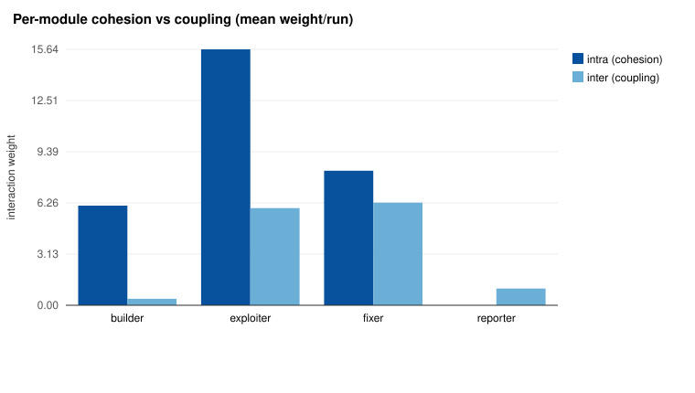
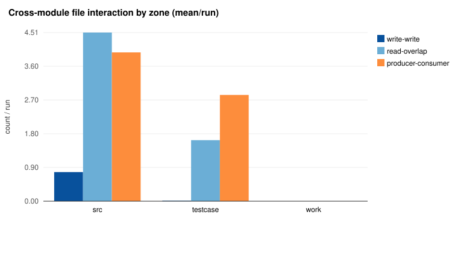

# Figures

## fig1_node_dsm.svg

Node x node interaction DSM for a representative run (faad2.cve-2018-20358); cell = message + dataflow weight, nodes grouped by module. Dense block-diagonals are within-module cohesion; sparse off-blocks are inter-module coupling.

## fig2_module_dsm.svg

Aggregate module x module interaction (mean weight per run). The bright diagonal (cohesion) and the boss row/column (sole inter-module relay) dominate; non-boss off-diagonal coupling is comparatively small.

## fig3_module_dataflow_dsm.svg

Directed producer->consumer file dataflow between modules (row writes, column reads), concentrated along the prescribed Builder->Exploiter->Fixer->Reporter handoff.

## fig4_recovery_nmi.svg

Unsupervised community detection recovers the prescribed modules: full interaction graph NMI ~0.75, dataflow-only (purely behavioral) ~0.65, both far above a random-partition baseline ~0.39. The full-vs-dataflow gap quantifies how much recovery is topology-driven.

## fig5_coupling_null_z.svg

Per-run z-score of the observed inter-module dataflow fraction against a label-permutation null. Mass left of the dashed line = coupling below chance (mean z ~ -1.8).

## fig6_module_instability.svg

Module instability mirrors the prescribed dependency DAG: Builder is stable (its build outputs are consumed downstream), Reporter is unstable (consumes all, consumed by none).

## fig7_cohesion_coupling.svg

Within-module interaction (cohesion) exceeds cross-module interaction (coupling) for every module.

## fig8_file_overlap_zone.svg

File interaction by workspace zone: /src read-overlap is shared input (expected), cross-module producer->consumer concentrates in /testcase + /src (the prescribed handoff), write-write contention is small.